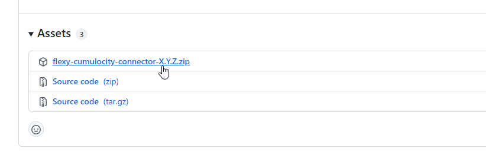
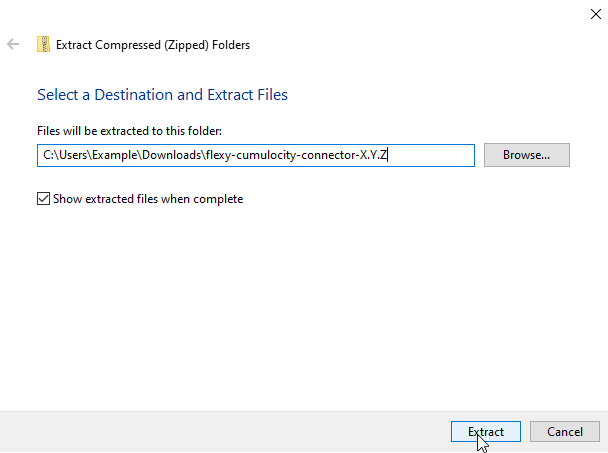
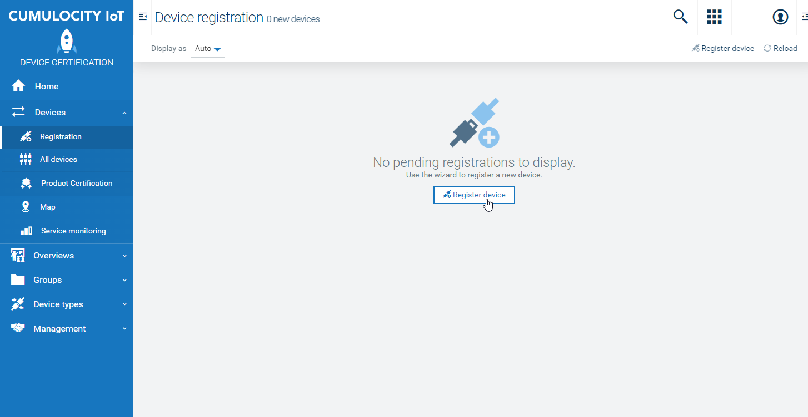
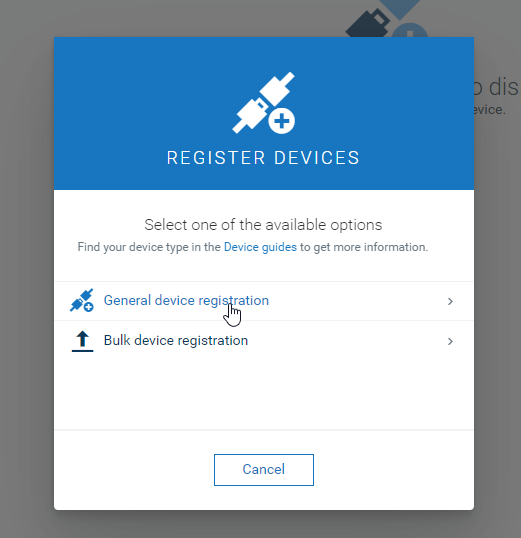
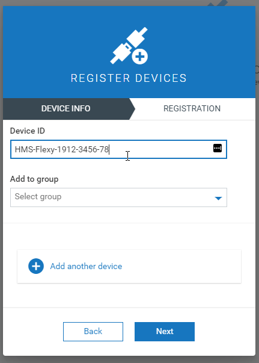
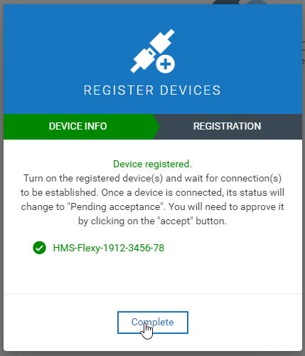
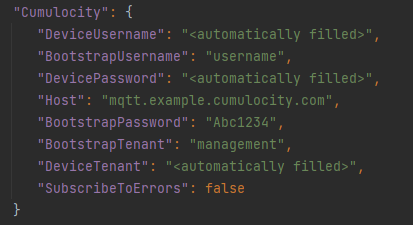

# Ewon Flexy Cumulocity Connector

Copyright © 2022 HMS Industrial Networks Inc.

The Ewon Flexy Cumulocity Connector package provides a connector-based solution to Cumulocity for
linking Ewon devices using a direct data path with a Flexy Java application.

**Note**: This document provides a quick start guide for using this connector. For a more comprehensive description of this process and the connector, please check out the [Installation and Configuration Guide](https://hmsnetworks.blob.core.windows.net/www/docs/librariesprovider10/downloads-monitored/software/flexy-cumulocity-integration-installation-and-configuration-guide-v1.0.pdf?sfvrsn=1490cbd7_5) and the [Technical Documentation](https://hmsnetworks.blob.core.windows.net/www/docs/librariesprovider10/downloads-monitored/software/solution-pack---ewon-cumulocity-connector---technical-documentation.pdf).

## Download

Prior to configuration or installation, you must download and extract the Ewon Flexy Cumulocity
Connector release package.

To download the latest Ewon Flexy Cumulocity Connector release package, visit the repository's
GitHub Releases page,
[https://github.com/hms-networks/flexy-cumulocity-connector/releases/latest](https://github.com/hms-networks/flexy-cumulocity-connector/releases/latest)
.

Expand the 'Assets' section to see the full list of files for the release, then click to download
the 'flexy-cumulocity-connector-X.Y.Z.zip' file. *Note: X.Y.Z is the exact version number of the
release package.*

Using the tool of your choice, unzip the 'flexy-cumulocity-connector-X.Y.Z.zip' file.

After the Ewon Flexy Cumulocity Connector release package is extracted, you may perform
configuration and installation as described below.

## Configuration

In order to connect the Ewon Flexy Cumulocity Connector against your Cumulocity Instance, you must
create a device registration entry in Cumulocity.

### Cumulocity Registration

To create a device registration entry in Cumulocity, you will need to open the Cumulocity UI and
navigate to the 'Registration' tab under 'Devices'.

Click the 'Register Device' button to begin the registration process.

Select the 'General device registration' option.

*Note: You may select the bulk device registration option if you wish to register multiple devices
at once. These instructions describe only the general device registration process.*

Enter the device ID of the Ewon Flexy you are registering. The Cumulocity device ID for an Ewon
device is based on the serial number of the Ewon Flexy, and is formatted as `HMS-Flexy-{SERIAL}`.

After entering the device ID, you may optionally specify a group to add the newly registered device
to, or register another device.

When finished, click the 'Next' button to finalize device registration, then click the 'Complete'
button when finished.

After the device registration has been completed and the remaining steps completed as described
below, you may start up the Ewon Flexy Cumulocity Connector and the device will register itself.
Once registered, it will be pending acceptance in the Cumulocity device registration portal.

### Connector Configuration File

The bootstrap credentials from your Cumulocity tenant must be configured in the connector
configuration file prior to installing or starting the connector.

Using a text editor/IDE of your choice, edit the `CumulocityConnectorConfig.json`
file located in the `starting-files` directory of the extracted Ewon Flexy Cumulocity Connector
release package.

Populate the `Host`, `BootstrapUsername`, `BootstrapPassword`, and `BootstrapTenant` fields with the
corresponding values for your Cumulocity tenant. The `Host` field should be populated with the
MQTT broker's host for your Cumulocity instance, for example, `mqtt.eu-latest.cumulocity.com` or
`mqtt.us-latest.cumulocity.com`. Do not include the scheme or port as they are automatically selected to be https:// and 8883.

Typically, the following example values are the standard values for all public Cumulocity instances maintained by SoftwareAG on its **European** server,

The `BootstrapTenant` is the bootstrap tenantID which is `management`;

The `BootstrapUsername` is the bootstrap username, which is `devicebootstrap`;

The `Host` is `mqtt.eu-latest.cumulocity.com`;

And the `BootstrapPassword` is `Fhdt1bb1f`.

Once populated, save the file and continue with installation.

## Installation

Installation of the Ewon Flexy Cumulocity Connector is simple, and requires only the upload of a
handful of files to your Ewon device.

Using an FTP client of your choice, such as [Filezilla](https://filezilla-project.org/), upload the
following files to the /usr directory of the Ewon device, including the
populated `CumulocityConnectorConfig.json` from earlier.

1. `flexy-cumulocity-connector-{VERSION}-full.jar`
    1. Located in the `target` folder
2. `jvmrun`
    1. Located in the `starting-files` folder
3. `CumulocityConnectorConfig.json`
    1. Located in the `starting-files` folder

Once uploaded, restart the Ewon device and the Ewon Flexy Cumulocity Connector will start up
automatically (using the uploaded `jvmrun` file).
