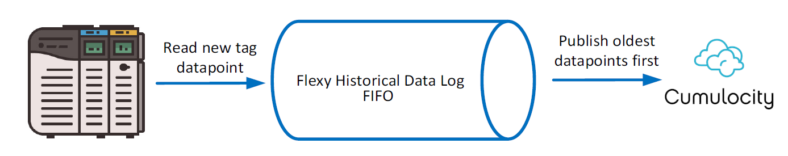

# Ewon Flexy Cumulocity Connector

Copyright © 2022 HMS Industrial Networks Inc.

The Ewon Flexy Cumulocity Connector package provides a connector-based solution to Cumulocity for
linking Ewon devices using a direct data path with a Flexy Java application.

## Table of contents

- [Installation](#installation)
    - [Required Ewon Firmware Version](#required-ewon-firmware-version)
    - [Network Requirements](#network-requirements)
- [Configuration](#configuration)
    - [Connector](#connector)
        - [Log Level (LogLevel)](#log-level-loglevel)
        - [UTF-8 String Support (UTF8StringSupport)](#utf-8-string-support-utf8stringsupport)
        - [Queue Diagnostic Tags Enabled (QueueEnableDiagnosticTags)](#queue-diagnostic-tags-enabled-queueenablediagnostictags)
        - [Queue Enable String History (QueueEnableStringHistory)](#queue-enable-string-history-queueenablestringhistory)
        - [Queue Data Poll Size (QueueDataPollSizeMins)](#queue-data-poll-size-queuedatapollsizemins)
        - [Queue Data Poll Max Behind Time (QueueDataPollMaxBehindTimeMins)](#queue-data-poll-max-behind-time-queuedatapollmaxbehindtimemins)
        - [Queue Data Poll Interval (QueueDataPollIntervalMillis)](#queue-data-poll-interval-queuedatapollintervalmillis)
    - [Cumulocity](#cumulocity)
        - [Host (Host)](#host-host)
        - [Port (Port)](#port-port)
        - [Custom Certificate URL (CustomCertificateUrl)](#custom-certificate-url-customcertificateurl)
        - [Custom Certificate URL Enabled (CustomCertificateUrlEnabled)](#custom-certificate-url-enabled-customcertificateurlenabled)
        - [Bootstrap Username (BootstrapUsername)](#bootstrap-username-bootstrapusername)
        - [Bootstrap Password (BootstrapPassword)](#bootstrap-password-bootstrappassword)
        - [Bootstrap Tenant (BootstrapTenant)](#bootstrap-tenant-bootstraptenant)
        - [Device Username (DeviceUsername)](#device-username-deviceusername)
        - [Device Password (DevicePassword)](#device-password-devicepassword)
        - [Device Tenant (DeviceTenant)](#device-tenant-devicetenant)
        - [Data Processing Mode (DataProcessingMode)](#data-processing-mode-dataprocessingmode)
        - [Parent Device Aggregated Payload Type (ParentDeviceAggregatedPayloadType)](#parent-device-aggregated-payload-type-parentdeviceaggregatedpayloadtype)
- [Telemetry](#telemetry)
    - [Data Source](#data-source)
        - [Tag Eligibility](#tag-eligibility)
            - [Tag Data Types](#tag-data-types)
                - [String Tag History](#string-tag-history)
    - [Data Aggregation](#data-aggregation)
        - [Data Aggregation Configuration Parameters](#data-aggregation-configuration-parameters)
        - [Data Aggregation Modes](#data-aggregation-modes)
            - [Calculations for Boolean Data Types](#calculations-for-boolean-data-types)
        - [Data Aggregation Timestamps](#data-aggregation-timestamps)
        - [Data Aggregation Payload Format](#data-aggregation-payload-format)
- [Runtime](#runtime)
    - [Child Device Support](#child-device-support)
        - [Child Device Tag Name Syntax](#child-device-tag-name-syntax)
        - [Child Device Tag Name Examples](#child-device-tag-name-examples)
    - [Connector Halt Tag](#connector-halt-tag)
    - [Supported Cumulocity Operations](#supported-cumulocity-operations)
    - [Commands from Cumulocity](#commands-from-cumulocity)
    - [REST API](#rest-api)
        - [Control Endpoints](#control-endpoints)
        - [Status Endpoints](#status-endpoints)
        - [Bootstrap/Provisioning Endpoints](#bootstrapprovisioning-endpoints)
        - [Response Format](#response-format)
    - [Log Output](#log-output)
        - [Configured Logging Level](#configured-logging-level)
        - [Logging Performance](#logging-performance)
        - [Adding Log Output](#adding-log-output)
- [Development Environment](#development-environment)
    - [Libraries and Dependencies](#libraries-and-dependencies)
    - [Source Code](#source-code)
        - [Cloning](#cloning)
        - [Existing Thread.sleep() Invocations](#existing-threadsleep-invocations)
    - [Javadocs](#javadocs)
    - [Releases](#releases)
        - [Automatic Startup (jvmrun)](#automatic-startup-jvmrun)
    - [Contributing](#contributing)
- [Support](#support)
    - [Reporting Bugs and Issues](#reporting-bugs-and-issues)
    - [Flexy Support](#flexy-support)
    - [Development Environment Support](#development-environment-support)

## Installation

Installation of the Ewon Flexy Cumulocity Connector package is simple, and only requires the upload
of a handful of files to the Ewon device. For your convenience, the process is described in
the [QUICK-START.md](QUICK-START.md) quick start guide.

### Required Ewon Firmware Version

This project requires a minimum Ewon firmware version of 14.5 or higher. Older firmware versions may
be incompatible and are not supported.

### Network Requirements

By default, this project connects to Cumulocity using MQTT over port 8883. Port 8883 must be
permitted on the connected Ewon network(s). If the port has been changed, as described in
the [Port (Port) configuration section](#port-port), the desired port must be permitted on the
connected Ewon network(s).

## Configuration

### Connector

This section contains configuration fields which are used to configure the connector.

#### Log Level (LogLevel)

The Ewon Flexy Cumulocity Connector uses the HMS Solution Center extensions library for application
logging to the Ewon Flexy's realtime logs. See [Configured Log Level](#configured-logging-level) for
more information.

#### UTF-8 String Support (UTF8StringSupport)

Parameter to enable support for tags with UTF-8 encoded characters.

#### Queue Diagnostic Tags Enabled (QueueEnableDiagnosticTags)

Parameter to enable and monitor a set of diagnostic tags for the historical data queue. These tags
are automatically created and are used to monitor the health of the historical data queue by
displaying a heartbeat with the number of times the queue has been accessed, a trigger to reset the
queue time tracker, and the number of seconds which the queue is running behind by.

#### Queue Enable String History (QueueEnableStringHistory)

Parameter to configure if string history data should be retrieved from the queue. String history
requires an additional EBD call in the underlying queue library, and will take extra processing
time, especially in installations with large string tag counts.

#### Queue Data Poll Size (QueueDataPollSizeMins)

Parameter to configure the data poll size (in minutes) of each data queue poll. Changing this will
modify the amount of data checked during each poll interval.

#### Queue Data Poll Max Behind Time (QueueDataPollMaxBehindTimeMins)

Parameter to configure the data poll maximum behind time (in minutes). Changing this will
modify the maximum number of minutes which the historical queue data polling may be running behind
by. A value of `-1` disables this functionality.

#### Queue Data Poll Interval (QueueDataPollIntervalMillis)

Parameter to configure the data poll interval (in milliseconds) to poll the historical data queue.
Changing this will modify the amount of time between each check (poll) for data.

#### Queue Data Aggregation Period in Seconds (QueueDataAggregationPeriodSecs)

Parameter to enable and configure the data aggregation period (in seconds) for the historical data
queue. To disable queue data aggregation, set this parameter to `-1`. Changing this will modify the
amount of time between each aggregation of data points in the queue.

#### Queue Data Aggregation Method (QueueDataAggregationMethod)

Parameter to configure the data aggregation method for the historical data queue. This parameter is
used to determine how multiple data points in a single aggregation period are aggregated into a
single data point. The following aggregation methods are supported:

- 0: Last Recorded Value (Newest)
- 1: First Recorded Value (Oldest)
- 2: Minimum Recorded Value (Lowest)
- 3: Maximum Recorded Value (Highest)
- 4: Average Recorded Value (Average)

_Note: The aggregation method is only used when queue data aggregation is enabled, as described
above in the `QueueDataAggregationPeriodSecs` parameter description._

### Cumulocity

This section contains configuration fields which are used to configure the connection to Cumulocity.

#### Host (Host)

Parameter to specify the host name of the Cumulocity server. This must be configured prior to
running the connector.

#### Port (Port)

Optional string parameter to specify the port of the Cumulocity server. Default: "8883"

#### Custom Certificate URL (CustomCertificateUrl)

Optional string parameter to specify the custom certificate URL for the Cumulocity server's
certificate.
Default: "https://certs.godaddy.com/repository/gdroot-g2.crt"

This parameter is useful when connecting to Cumulocity Edge servers which use a self-signed
certificate.

#### Custom Certificate URL Enabled (CustomCertificateUrlEnabled)

Optional boolean parameter to enable the custom certificate URL for the Cumulocity server's
certificate.
Default: false

This parameter is useful when connecting to Cumulocity Edge servers which use a self-signed
certificate.

#### Bootstrap Username (BootstrapUsername)

Parameter to specify the bootstrap username to use when registering to Cumulocity. This must be
configured prior to running the connector.

#### Bootstrap Password (BootstrapPassword)

Parameter to specify the bootstrap password to use when registering to Cumulocity. This must be
configured prior to running the connector.

#### Bootstrap Tenant (BootstrapTenant)

Parameter to specify the bootstrap tenant to use when registering to Cumulocity. This must be
configured prior to running the connector.

#### Subscribe to Errors (SubscribeToErrors)

Parameter to enable subscribing to errors from the Cumulocity server.

#### Device Username (DeviceUsername)

This configuration field is filled automatically by the connector application, and is the device
username used to authenticate with Cumulocity.

#### Device Password (DevicePassword)

This configuration field is filled automatically by the connector application, and is the device
password used to authenticate with Cumulocity.

#### Device Tenant (DeviceTenant)

This configuration field is filled automatically by the connector application, and is the device
tenant used to authenticate with Cumulocity.

#### Data Processing Mode (DataProcessingMode)

Parameter to configure the data processing mode.
This determines how data is processed by Cumulocity.
The following data processing modes are supported:

s: Persistent (Default)
t: Transient
q: Quiescent
c: CEP

More information about these data processing modes can be found in
the [Cumulocity documentation](https://cumulocity.com/guides/concepts/realtime/#implementation).

This field is optional, and if not specified, the default value of `s` will be used.

#### Parent Device Aggregated Payload Type (ParentDeviceAggregatedPayloadType)

Parameter to configure the parent (main/non-child) device aggregated payload type.
This determines the value for the `type` field in aggregated payloads for the parent device.

This field is optional, and if not specified, the default value of `None` will be used.

## Telemetry

### Data Source

The telemetry data that is sent to Cumulocity is gathered from the internal Ewon Flexy historical
logs. These logs act as a first-in, first-out (FIFO) buffer, meaning that Cumulocity will receive
the oldest data points from the logs first. The historical logs are stored in nonvolatile memory and
prevent against data point loss from connectivity issues or power loss. The historical log can store
up to 900,000 data points, depending on the memory configuration, before data points are dropped.

The default configuration of the Ewon Flexy is to allocate 6 MB of memory to the historical log and
29 MB to the /usr directory on the file system. Increasing the size of the historical log will
result in a proportional decrease of the size of the /usr directory. This setting can be configured
on the Ewon under Setup > System > Storage > Memory Settings.

Note: *This setting should be configured prior to installing the application, as a complete format
of the Ewon is necessary to apply this setting.*



#### Tag Eligibility

Each tag that should be sent to Cumulocity must have historical logging enabled. Please
visit [https://www.ewon.biz/technicalsupport/pages/data-services/data-logging](https://www.ewon.biz/technicalsupport/pages/data-services/data-logging)
for information on the Ewon’s historical logging functionality, and how to set it up.

In addition to historical logging being enabled, the Ewon Flexy Cumulocity Connector application
uses tag groups to determine which tags are to be sent to Cumulocity. There are four tag groups, A,
B, C, and D. Any tag assigned to one (or more) of the four tag groups will be sent to Cumulocity,
but tags that have not been assigned a tag group will be ignored.

##### Tag Data Types

The Ewon Flexy Cumulocity connector supports the following Ewon tag data types:

- Integer
- Boolean
- Floating Point
- DWORD
- String

###### String Tag History

The string data type requires an additional EBD (export block descriptor) call, which requires
additional processing power. It is recommended that the string data type be disabled if string tags
will not be used. It can be enabled or disabled as described in
the [Queue Enable String History](#queue-enable-string-history) section under
the [Configuration](#configuration) heading.

Additionally, the default configuration of the Ewon Flexy is to exclude string tags from the
historical log. String tag historization can be enabled on the Ewon under *Setup > System >
Storage > Memory Settings*.

Note: *This setting should be configured prior to installing the application, as a complete format
of the Ewon is necessary to apply this setting.*

### Data Aggregation

The Ewon Flexy Cumulocity Connector supports data aggregation for the historical data queue.
Data aggregation is used to reduce the number of data points sent to Cumulocity by aggregating
multiple data points into a single data point.
Currently, data aggregation is only supported for numerical data types (integer, boolean, floating
point, and DWORD).
String data types are not yet supported for data aggregation.

#### Data Aggregation Configuration Parameters

Data aggregation is configured using the following configuration file parameters:

- [Queue Data Aggregation Period in Seconds (QueueDataAggregationPeriodSecs)](#queue-data-aggregation-period-in-seconds-queuedataaggregationperiodsecs)
- [Queue Data Aggregation Method (QueueDataAggregationMethod)](#queue-data-aggregation-method-queuedataaggregationmethod)

#### Data Aggregation Modes

The following methods are supported for data aggregation (as described for configuration file
parameters linked above):

- Last Recorded Value (Newest)
- First Recorded Value (Oldest)
- Minimum Recorded Value (Lowest)
- Maximum Recorded Value (Highest)
- Average Recorded Value (Average)

##### Calculations for Boolean Data Types

Certain calculations for boolean data types are handled differently than other data types.
The following calculations are used for boolean data types:

- Minimum Recorded Value (Lowest)
    - If any value is false, the minimum value is false.
- Maximum Recorded Value (Highest)
    - If any value is true, the maximum value is true.
- Average Recorded Value (Average)
    - If there are more true values than false values, the average will be true.
    - If there are more false values than true values, or an equal number of true and false values,
      the average will be false.

#### Data Aggregation Timestamps

The aggregation period of each data point is determined by the rounding of the timestamp to the
nearest aggregation period.
For example, if the aggregation period is 60 seconds, and a data point is received at 12:00:00.500,
it will be grouped with the 12:00:00.000 aggregation period.
If the aggregation period is 60 seconds, and a data point is received at 12:00:46.000, it will be
grouped with the 12:01:00.000 aggregation period.

#### Data Aggregation Payload Format

The payload used for data aggregation follows the Cumulocity JSON via MQTT specification, outlined
at [https://cumulocity.com/guides/reference/smartrest-two/#create-a-measurement-data-point](https://cumulocity.com/guides/reference/smartrest-two/#create-a-measurement-data-point).

## Runtime

### Child Device Support

The Ewon Flexy does not have a defined syntax for creating child devices. The Ewon Flexy Cumulocity
Connector application implements child devices using a tag name format.

#### Child Device Tag Name Syntax

The following syntax can be used to create child devices:

- Tags that contain no "/" character<br>
  -> This data belongs directly to the gateway<br>
  -> The Cumulocity fragment name is the tag name<br>
  -> The Cumulocity series will automatically be "0"<br>
  -> Example: "One"<br>

- Tags that contain one (1) "/" character<br>
  -> This data belongs directly to the gateway<br>
  -> The Cumulocity fragment name is the tag name part before the "/"<br>
  -> The Cumulocity series is the tag name part after the "/"<br>
  -> Example: "One/2"<br>

- Tags that contain two (2) "/" characters<br>
  -> This data belongs to the child device named after the tag name part before the first "/"<br>
  -> The Cumulocity fragment name is the tag name part between the two "/" characters<br>
  -> The Cumulocity series is the tag name part after the second "/"
  -> Example: "One/Two/3"<br>

- Tags that contain three (3) or more "/" characters<br>
  -> Only the last three (3) "/" characters are used to determine the child device, fragment name,
  and series
  -> Example: "Extra/One/Two/3"<br>

#### Child Device Tag Name Examples

Using the syntax described in the [Child Device Tag Name Syntax](#child-device-tag-name-syntax)
section, the following examples are valid:

- "One"<br>
  a. Child Device: (none)<br>
- b. Fragment Name: "One"<br>
  c. Series: "0"<br>
- "One/2"<br>
  a. Child Device: (none)<br>
  b. Fragment Name: "One"<br>
  c. Series: "2"<br>
- "One/Two/3"<br>
  a. Child Device: "One"<br>
  b. Fragment Name: "Two"<br>
  c. Series: "3"<br>
- "Extra/One/Two/3"<br>
  a. Child Device: "One"<br>
  b. Fragment Name: "Two"<br>
  c. Series: "3"<br>

### Connector Halt Tag

The “CumulocityConnectorHalt” tag allows for a user to halt, or shut down, the application while the
Flexy is running. The application will cyclically poll the “CumulocityConnectorHalt” tag value and
shut down the application when the value is set to one (1). This reduces the CPU load of the Flexy
and allows for maintenance to be completed on the unit. The application can only be stopped in the
telemetry portion of the application and shut down during initialization is not permitted.

### Supported Cumulocity Operations

The Ewon Flexy Cumulocity Connector application supports the following Cumulocity
operations:[README.md](README.md)

- c8y_Firmware
    - This operation is used to update the firmware of the Ewon Flexy.
- c8y_Configuration
    - This operation is used to update the configuration of the Ewon Flexy.
- c8y_Command
    - This operation is used to send commands to the Ewon Flexy, as described in
      the [Commands from Cumulocity](#commands-from-cumulocity) section below.
- c8y_Restart
    - This operation is used to restart the Ewon Flexy.

Detailed information about these operations, and others supported by the Cumulocity platform, can be
found in the Cumulocity documentation
at [https://cumulocity.com/guides/reference/device-management-library/#c8y_supportedoperations-fragments](https://cumulocity.com/guides/reference/device-management-library/#c8y_supportedoperations-fragments).

### Commands from Cumulocity

The Ewon Flexy Cumulocity Connector application supports a handful of commands from Cumulocity that
allow you to control the Ewon Flexy.

The following commands are supported:

1. `set`
    1. Using the `set` command, you can set the value of a tag.
    2. Tags for child devices may also be set using the `set` command. Simply append the child
       device name followed by a forward-slash (`/`) to the tag name. For
       example, `set childName/tagName value`.
    3. The `set` command takes two parameters:
        1. The tag name
        2. The value to set the tag to
    4. Example: `set tagName value`
2. `setf`
    1. Using the `setf` command, you can set the value of a tag by its fragment and series.
    2. Tags for child devices may also be set using the `setf` command. Simply append the child
       device name followed by a forward-slash (`/`) to the fragment name. For
       example, `setf childName/fragmentName seriesName value`.
    3. The `setf` command takes three parameters:
        1. The fragment name
        2. The series name
        3. The value to set the tag to
    4. Example: `setf fragmentName seriesName value`
3. `measurements`
    1. Using the `measurements` command, you can enable or disable the measurements of the
       Connector.
    2. The `measurements` command takes one parameter:
        1. The enable/disable flag (`enable` or `disable`)
    3. Example: `measurements enable`

### REST API

The Ewon Flexy Cumulocity Connector application supports a REST API that allows you to control the
connector and see basic status information. The REST API is secured by the same login mechanism as
the Ewon Flexy's web interface.

#### Control Endpoints

1. Shutdown (shutdown)
    - Performs a shutdown of the connector.
    - `http://{EWON-HOST-ADDRESS}/rcgi.bin/jvmForm?formName=controlApi&shutdown=true`
    - via M2Web: `https://m2web.talk2m.com/t2mapi/get/{ewon-name}/rcgi.bin/jvmForm?formName=controlApi&shutdown=true`
2. Restart (restart)
    - Performs a restart of the connector.
    - `http://{EWON-HOST-ADDRESS}/rcgi.bin/jvmForm?formName=controlApi&restart=true`
    - via M2Web: `https://m2web.talk2m.com/t2mapi/get/{ewon-name}/rcgi.bin/jvmForm?formName=controlApi&restart=true`

#### Status Endpoints

1. Get Config (getConfig)
    - Returns the configuration of the connector.
    - `http://{EWON-HOST-ADDRESS}/rcgi.bin/jvmForm?formName=statusApi&getConfig=true`
    - via M2Web: `https://m2web.talk2m.com/t2mapi/get/{ewon-name}/rcgi.bin/jvmForm?formName=statusApi&getConfig=true`
2. Get Version (getVersion)
    - Returns the version number of the connector.
    - `http://{EWON-HOST-ADDRESS}/rcgi.bin/jvmForm?formName=statusApi&getVersion=true`
    - via M2Web: `https://m2web.talk2m.com/t2mapi/get/{ewon-name}/rcgi.bin/jvmForm?formName=statusApi&getVersion=true`

#### Bootstrap/Provisioning Endpoints

1. Set Bootstrap Authentication (setBootstrapAuth)
    - Sets the bootstrap authentication configuration of the connector.
    - `http://{EWON-HOST-ADDRESS}/rcgi.bin/jvmForm?formName=setBootstrapAuth&host={host}&port={port}&tenant={tenant}&username={username}&password={password}`
    - via M2Web: `https://m2web.talk2m.com/t2mapi/get/{ewon-name}/rcgi.bin/jvmForm?formName=setBootstrapAuth&host={host}&port={port}&tenant={tenant}&username={username}&password={password}`
    - Parameters:
        - `host`: The host name of the Cumulocity server.
        - `port`: The port number of the Cumulocity server.
        - `tenant`: The boostrap tenant name of the Cumulocity server.
        - `username`: The boostrap username of the Cumulocity server.
        - `password`: The boostrap password of the Cumulocity server.

2. Overwrite Bootstrap Authentication (overwriteBootstrapAuth)
    - Sets the bootstrap authentication configuration of the connector, overwriting any existing
      configuration. If an existing configuration is overwritten, the connector will be restarted to
      apply the new configuration.
    - `http://{EWON-HOST-ADDRESS}/rcgi.bin/jvmForm?formName=overwriteBootstrapAuth&host={host}&port={port}&tenant={tenant}&username={username}&password={password}`
    - via M2Web: `https://m2web.talk2m.com/t2mapi/get/{ewon-name}/rcgi.bin/jvmForm?formName=overwriteBootstrapAuth&host={host}&port={port}&tenant={tenant}&username={username}&password={password}`
    - Parameters:
        - `host`: The host name of the Cumulocity server.
        - `port`: The port number of the Cumulocity server.
        - `tenant`: The boostrap tenant name of the Cumulocity server.
        - `username`: The boostrap username of the Cumulocity server.
        - `password`: The boostrap password of the Cumulocity server.

#### Response Format

The Ewon Flexy Cumulocity Connector application REST API returns JSON formatted responses in the
following formats:

1. Success response format:

```json
{
  "status": "ok"
}
```

2. Success response format with content:

```json
{
  "status": "ok",
  "response": "{RESPONSE}"
}
```

3. Error response format:

```json
{
  "status": "error",
  "error": "{ERROR}"
}
```

### Log Output

#### Configured Logging Level

There are seven options for the configurable log level. The logging level is configured in the
application configuration, detailed in Section 4. Each log level includes the output for the log
levels below it (lower numerical value). For example, log level 3 (warning) includes the output for
log level 2 (serious) and log level 1 (critical). All positive log levels print to the Flexy
realtime logs, and negative log levels output for text files in the /usr directory of Ewon Flexy.
Log text files are named logN.txt, where N is an integer.

|     LogLevel     | Description                                                                      |
|:----------------:|:---------------------------------------------------------------------------------|
|  6, -6 (Trace)   | Exception stack traces                                                           |
|  5, -5 (Debug)   | Low level information about the state of the application                         |
|   4, -4 (Info)   | Application state information                                                    |
| 3, -3 (Warning)  | Issues encountered in the application that are not serious                       |
| 2, -2 (Serious)  | Errors that are serious but recoverable                                          |
| 1, -1 (Critical) | Critical application log messages (Startup, Initialization, Unrecoverable Error) |
|     0 (None)     | Logging is disabled                                                              |

#### Logging Performance

The log output has an impact on the performance of the application. For normal operation, the log
level should be set to the lowest numerical value (highest when outputting to log files) that will
produce satisfactory logs. For debugging issues with the application or a device, higher numerical
values (lower when outputting to log files) can be used to print additional information to help
diagnose.

Negative log values utilize log files in the /usr directory to store log output. This should only be
enabled for short periods of time while diagnosing problems. Leaving this enabled for extended
periods of time will cause excessive wear on the flash memory of the Ewon Flexy and could cause
irreparable damage.

#### Adding Log Output

Log output can be added to the application by inserting calls to the logging class, Logger. Each log
level has a method that will output the log to the appropriate location. For example, a call
to `Logger.LOG_DEBUG(String)` will result in log output that is visible if the configured
application log level is set to debug (5/-5) or trace (6/-6). A call
to `Logger.LOG_CRITICAL(String)` will result in log output that is visible if the configured
application log level is set to critical (1/-1) or a higher logging level. A call
to `Logger.LOG_EXCEPTION(Exception)` will result in log output that is visible if the configured
application log level is set to trace (6/-6).

## Development Environment

This project is based on
the [Solution Center Maven Starter Project](https://github.com/hms-networks/sc-java-maven-starter-project)
, and uses the Maven build system for compilation, testing, and packaging.

Maven lifecycle information and other details about the development environment provided by
the [Solution Center Maven Starter Project](https://github.com/hms-networks/sc-java-maven-starter-project)
can be found in its README.md
at [https://github.com/hms-networks/sc-java-maven-starter-project/blob/main/README.md](https://github.com/hms-networks/sc-java-maven-starter-project/blob/main/README.md)
.

### Libraries and Dependencies

The following libraries and dependencies are required for this project to run:

1. Ewon ETK
   ```xml
   <dependencies>
      ...
      <dependency>
         <groupId>com.hms_networks.americas.sc.mvnlibs</groupId>
         <artifactId>ewon-etk</artifactId>
         <version>X.Y.Z</version>
         <scope>provided</scope>
      </dependency>
      ...
   </dependencies>
   ```
   _Note: The scope must be set to 'provided' for the Ewon ETK dependency. This indicates that the
   library is provided by the system and does not need to be included in the packaged JAR file._
2. JUnit
   ```xml
   <dependencies>
      ...
      <dependency>
         <groupId>junit</groupId>
         <artifactId>junit</artifactId>
         <version>X.Y.Z</version>
         <scope>test</scope>
      </dependency>
      ...
   </dependencies>
   ```
   _Note: The scope must be set to 'test' for the JUnit dependency. This indicates that the library
   is required for code testing and does not need to be included in the packaged JAR file._
3. Ewon Flexy Extensions Library
   ```xml
   <dependencies>
      ...
      <dependency>
         <groupId>com.hms_networks.americas.sc</groupId>
         <artifactId>extensions</artifactId>
         <version>X.Y.Z</version>
      </dependency>
      ...
   </dependencies>
   ```

As required, you can include additional libraries or dependencies using the Maven build system. To
add a new library or dependency, add a new `<dependency></dependency>` block in
the `<dependencies></dependencies>` section of your `pom.xml`.

### Source Code

Source code and IDE project files for the Ewon Flexy Cumulocity Connector are made available in
the [hms-networks/flexy-cumulocity-connector](https://github.com/hms-networks/flexy-cumulocity-connector)
repository on GitHub. They are also included in release(.zip)

#### Cloning

The source code can be downloaded using Git clone. For more information about the Git clone command,
please refer to the GitHub clone documentation
at [https://docs.github.com/en/github/creating-cloning-and-archiving-repositories/cloning-a-repository](https://docs.github.com/en/github/creating-cloning-and-archiving-repositories/cloning-a-repository)
.

Using the git client of your choice, clone
the https://github.com/hms-networks/flexy-cumulocity-connector repository.

Using HTTPS:

```console
> git clone https://github.com/hms-networks/flexy-cumulocity-connector.git --recursive
```

Using SSH:

```console
> git clone git@github.com:hms-networks/flexy-cumulocity-connector.git --recursive
```

#### Existing Thread.sleep() Invocations

In many locations throughout the application, calls are made to Thread.sleep(). These calls are
necessary to signal to the JVM and the Ewon Flexy that other processes can be serviced. Reducing or
removing these calls to Thread.sleep() may cause stability issues with the Flexy. This behavior may
manifest as a device reboot.

### Javadocs

Developer documentation is available in Javadoc jar format in /target folder of release packages. A
generated copy can also be found in the /target/apidocs folder after compiling with Maven.

### Releases

To release a compiled version of the Ewon Flexy Cumulocity Connector, two files must be supplied to
the end-user, the compiled Ewon Flexy Cumulocity Connector jar, and a jvmrun file. The files should
be installed to the /usr directory of the Ewon Flexy. On the first run of the application, a default
application configuration will be written to the Ewon’s filesystem. This can be modified to include
the desired configuration, as outlined under the [Configuration](#configuration) heading.

Official releases of the Ewon Flexy Cumulocity Connector can be found and downloaded
from [https://github.com/hms-networks/flexy-cumulocity-connector/releases](https://github.com/hms-networks/flexy-cumulocity-connector/releases)
.

#### Automatic Startup (jvmrun)

On startup, the Ewon Flexy will look for the presence of a jvmrun file. If present, the Ewon Flexy
will automatically launch the application referenced in the jvmrun script with the configured
settings.

The jvmrun script, included in the /scripts folder, configures the connector application to run with
a 25 MB heap. If the heap size is reduced in the jvmrun script, the application may become unstable
and could crash if unable to allocate memory.

### Contributing

Detailed information about contributing to this project can be found
in [CONTRIBUTING.md](CONTRIBUTING.md).

## Support

Support for the Ewon Flexy Cumulocity Connector may be available under the terms of your quote, if
applicable. New or additional support can be purchased, as needed, by contacting your HMS
salesperson. If you don't know your HMS salesperson, please visit the HMS contact information page
at [https://www.hms-networks.com/contact](https://www.hms-networks.com/contact).

### Reporting Bugs and Issues

If you encounter a bug or issue in the Ewon Flexy Cumulocity Connector, please open an issue on the
GitHub repository issues page, found
at [https://github.com/hms-networks/flexy-cumulocity-connector/issues](https://github.com/hms-networks/flexy-cumulocity-connector/issues)
.

### Flexy Support

Support and additional information about the Ewon Flexy can be found on the Ewon support homepage
at [https://ewon.biz/technical-support/support-home](https://ewon.biz/technical-support/support-home)
.

### Development Environment Support

Detailed information about the development environment provided by
the [Solution Center Maven Starter Project](https://github.com/hms-networks/sc-java-maven-starter-project)
can be found in its README.md
at [https://github.com/hms-networks/sc-java-maven-starter-project/blob/main/README.md](https://github.com/hms-networks/sc-java-maven-starter-project/blob/main/README.md)
.

Additional information and support about the Ewon ETK can be found on the Ewon Java programming
homepage at [https://developer.ewon.biz/content/java-0](https://developer.ewon.biz/content/java-0).